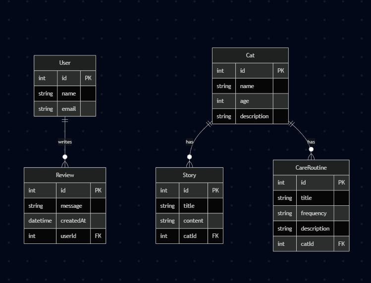

# ЛР 2. Создание доменной модели и её описание

## Описание проекта

В рамках данной лабораторной работы была спроектирована и реализована доменная модель веб-приложения, посвящённого домашнему питомцу — кошке Нори.

Приложение расширяет функциональность предыдущей лабораторной работы (ЛР1) за счёт подключения реляционной базы данных и организации хранения данных с использованием ORM Prisma.

Система позволяет:

* хранить информацию о питомце
* публиковать истории из жизни
* описывать процедуры ухода
* сохранять и отображать отзывы пользователей


## Развёртывание базы данных

В качестве СУБД используется PostgreSQL, развернутый на платформе Render.

Для подключения используется строка соединения, сохранённая в переменной окружения:

```bash
DATABASE_URL
```

База данных успешно подключена к приложению, что подтверждается корректной работой API и возможностью чтения/записи данных.


## Используемые технологии

* Node.js
* NestJS / Express
* Prisma ORM
* PostgreSQL
* Render


## Описание предметной области

Предметной областью является система управления информацией о домашнем питомце и взаимодействием пользователей с этой информацией.

Пользователи могут оставлять отзывы, а система хранит структурированные данные о питомце, включая истории и процедуры ухода.


## Доменная модель

В системе выделено 5 основных сущностей:

### User

Пользователь, оставляющий отзывы.

**Поля:**

* id — уникальный идентификатор
* name — имя
* email — электронная почта


### Review

Отзыв пользователя.

**Поля:**

* id — уникальный идентификатор
* message — текст отзыва
* createdAt — дата создания
* userId — ссылка на пользователя


### Cat

Питомец (основная сущность системы).

**Поля:**

* id — уникальный идентификатор
* name — имя
* age — возраст
* description — описание


### Story

История из жизни питомца.

**Поля:**

* id — уникальный идентификатор
* title — заголовок
* content — текст
* catId — ссылка на питомца


### CareRoutine

Процедура ухода за питомцем.

**Поля:**

* id — уникальный идентификатор
* title — название
* frequency — частота
* description — описание
* catId — ссылка на питомца


## Связи между сущностями

* Один пользователь (**User**) может иметь несколько отзывов (**Review**)
* Один питомец (**Cat**) может иметь несколько историй (**Story**)
* Один питомец (**Cat**) может иметь несколько процедур ухода (**CareRoutine**)

Все связи реализованы как «один-ко-многим».


## Работа с базой данных

Для взаимодействия с базой данных используется Prisma ORM.

Схема базы данных описана в файле:

```
prisma/schema.prisma
```

Для генерации клиента используется команда:

```bash
npx prisma generate
```


## Миграции

Для управления структурой базы данных используется механизм миграций Prisma:

```bash
npx prisma migrate dev --name init
```

Миграции позволяют инкрементально изменять структуру базы данных без потери данных.


## ER-диаграмма

Ниже представлена ER-диаграмма базы данных:




## Результаты

В ходе выполнения лабораторной работы:

* Развернута реляционная база данных PostgreSQL
* Настроено подключение приложения к базе данных
* Реализована доменная модель, включающая 5 сущностей
* Настроена ORM Prisma для работы с данными
* Реализованы связи между сущностями
* Создана ER-диаграмма базы данных


## Автор

Васильевская Ксения Васильевна
Группа: M3312
